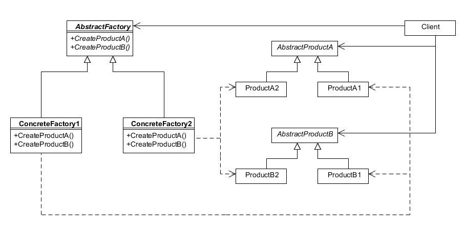

# Abstract Factory

## Intent

Provide an interface for creating families of related or dependent objects without specifying their concrete classes.

## Structure

## Participants

- AbstractFactory (MazeFactory)

	- declares an interface for operations that create abstract product objects.

- ConcreteFactory (BombedMazeFactory, EnchantedMazeFactory)

	- implements the operations that create concrete product object

- AbstractProduct (Maze, Room, Door, Wall)

	- declares an interface for a type of product object

- ConcreteProduct (RoomWithABomb, EnchantedRoom, DoorNeedingSpell, BombedWall)

	- defines a product object to be created by the corresponding concrete factory.

	- implements the AbstractProduct interface.

- Client (MazeGame)

	- uses only interfaces declared by AbstractFactory and AbstractProductFactory classes.

## Collaborations

-  To create different product objects, clients should use a different concrete factory.

## Consequences

- pros:
	
	- It isolates concrete classes. they do not appear in client code.

	- It promotes consistency among products

- cons:
	
	- Supporting new kinds of products  is difficult. To add new products, requires changes to the AbstractFactory class and all of its subclasses.
